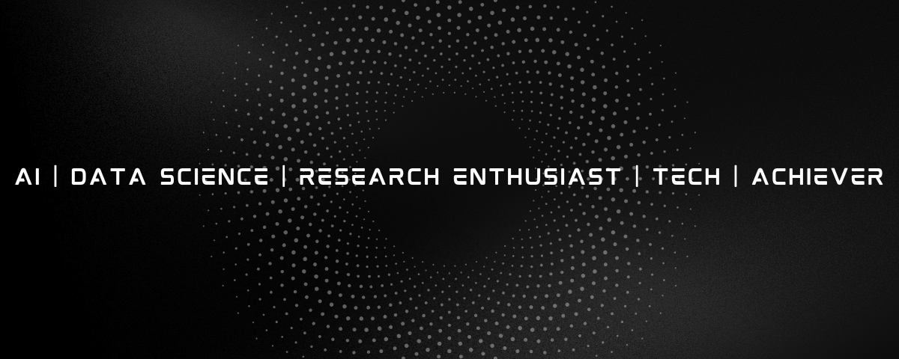

## Hi there, this is Adarsh 

# 💫 About Me:
💼 Working as Junior Executive – RF Planning & Reporting
⚡ Working in the Smart Metering & AMI domain
📡 Experience with RF Planning, Gateway/MEG, HES & NMS
📊 Aspiring Data Analyst
🧮 Skilled in Excel, SQL & Power BI
🐍 Learning & working with Python, Pandas & Data Visualization
🤖 Interested in Automation & Process Optimization
💡 Passionate about turning data into actionable insights

## 🌐 Connect With Me:
)  

# 💻 Here are some of the tools, frameworks, and languages I've worked with:
## 📊 Data Analytics Skills

## 📡 Smart Metering & RF Skills

## 💡 Core Expertise

- 📊 Data Analysis & Reporting
- 📈 Dashboard Development
- 🧮 Advanced Excel & SQL
- 🐍 Python Data Analysis
- 📡 RF Planning & Network Analysis
- ⚡ Smart Metering & AMI
- 🌐 Gateway / MEG & HES
- 🗺️ GIS & Geospatial Analysis
- 🤖 Process Automation
# 📊 GitHub Stats:

<!-- Proudly created with GPRM ( https://gprm.itsvg.in ) -->
